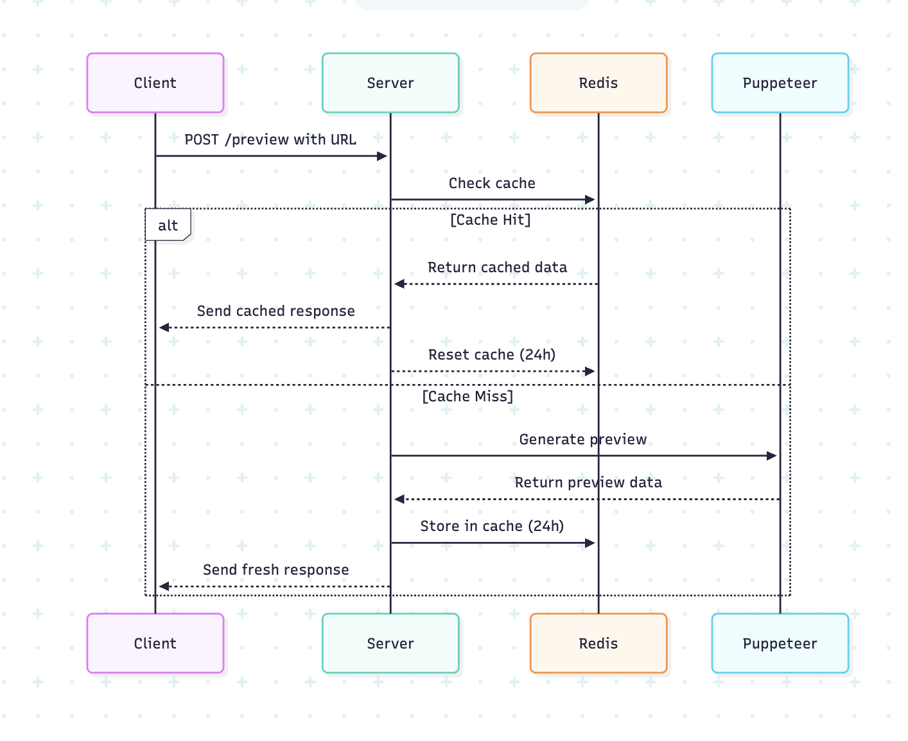

# Link Preview Service

A Node.js Express API that generates rich link previews using Puppeteer (with stealth plugin), Redis caching, and HTML metadata scraping.

---

## Features

- **/preview**: Generate a preview for a single URL (with caching)
- **/previews**: Generate previews for multiple URLs (with caching)
- **/cache**: Clear cache for a specific URL
- **/cache-stats**: Get Redis cache statistics
- **/cache-keys**: List all cached preview keys and values

---

## Requirements

- Node.js (v18+ recommended)
- Redis server

---

## Installation

```bash
git clone https://github.com/Sonukr/link-preview.git
cd link-preview
npm install
```

---

## Environment Variables

- `PORT` (default: 3000)
- `REDIS_URL` (default: redis://localhost:6379)
- `REDIS_EXPIRE` (default: 86400 seconds)

---

## Usage

Start Redis, then:

```bash
node withRedis.js
```

---

## API Endpoints

### 1. `POST /preview`

**Request:**
```json
{
  "url": "https://example.com"
}
```

**Response:**
```json
{
  "title": "...",
  "siteName": "...",
  "description": "...",
  "url": "...",
  "icon": "...",
  "image": "...",
  "isScreenshot": true,
  "metadata": { ... }
}
```

---

### 2. `POST /previews`

**Request:**
```json
{
  "urls": ["https://a.com", "https://b.com"]
}
```

**Response:**
```json
[
  { "url": "...", "data": { ... } },
  { "url": "...", "data": { ... } }
]
```

---

### 3. `DELETE /cache`

**Request:**
```json
{ "url": "https://example.com" }
```

**Response:**
```json
{ "status": "cache cleared" }
```

---

### 4. `GET /cache-stats`

Returns Redis info as plain text.

---

### 5. `GET /cache-keys`

Returns all cached preview keys and their values.

---

## Sequence Diagram

Below is a sequence diagram for the `/preview` endpoint:



## Packages Used

- **express**: Web server framework
- **puppeteer-extra**: Headless browser automation
- **puppeteer-extra-plugin-stealth**: Avoids bot detection
- **redis**: Redis client for Node.js

---

## License

MIT
